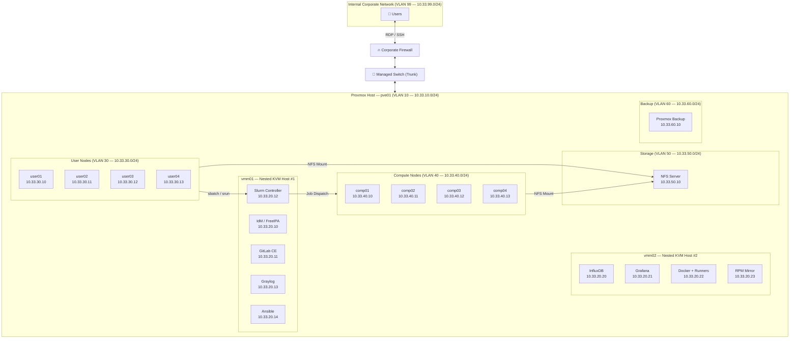
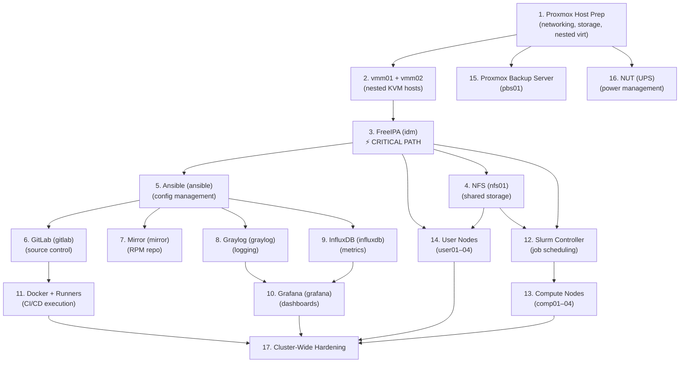

## 1.1 Cluster Topology Overview

Before I touch a single VM or config file, I'm laying out the full architecture on paper. This is the most important part — every shortcut here becomes a headache later. I'm building an infrastructure management cluster on a single Proxmox host, using nested KVM to simulate two separate hypervisors (vmm01 and vmm02), with dedicated user nodes, compute nodes, shared storage, and a full observability stack.

### Logical Architecture Diagram

Here's the topology I'm implementing, rendered as a Mermaid diagram:



### Node Categories

I'm organizing the cluster into five logical categories. Every VM falls into exactly one:

| Category | Purpose | VMs | Hosted On |
|---|---|---|---|
| **Service Nodes** | Core infrastructure services (auth, git, logging, monitoring, CI/CD, config mgmt) | idm, gitlab, slurm, graylog, ansible, influxdb, grafana, docker, mirror | Nested inside vmm01 or vmm02 |
| **User Nodes** | Interactive remote desktop sessions for end users | user01–user04 | Directly on Proxmox |
| **Compute Nodes** | Slurm-managed batch job execution (ML, HPC, general) | comp01–comp04 | Directly on Proxmox |
| **Storage Node** | Centralized NFS file server for home dirs, scratch, software | nfs01 | Directly on Proxmox |
| **Infrastructure** | Backups, UPS management, network switching | pbs01, UPS (NUT), managed switch | Directly on Proxmox + physical |

### How Nested KVM Maps onto a Single Proxmox Host

Here's the layer cake I'm building:

```
┌─────────────────────────────────────────────────────┐
│                   Proxmox VE (pve01)                │  ← Layer 0: Physical host
│                                                     │
│  ┌──────────────┐  ┌──────────────┐                 │
│  │   vmm01 VM   │  │   vmm02 VM   │  ← Layer 1: Proxmox VMs running KVM
│  │  (libvirt)   │  │  (libvirt)   │                 │
│  │              │  │              │                 │
│  │ ┌──┐┌──┐┌──┐│  │ ┌──┐┌──┐┌──┐│  ← Layer 2: Nested VMs (service nodes)
│  │ │id││gl││sl││  │ │in││gr││dk││                 │
│  │ └──┘└──┘└──┘│  │ └──┘└──┘└──┘│                 │
│  │ ┌──┐┌──┐    │  │ ┌──┐        │                 │
│  │ │gy││an│    │  │ │mi│        │                 │
│  │ └──┘└──┘    │  │ └──┘        │                 │
│  └──────────────┘  └──────────────┘                 │
│                                                     │
│  ┌──────┐┌──────┐┌──────┐┌──────┐  ← Regular Proxmox VMs (user nodes)
│  │user01││user02││user03││user04│                   │
│  └──────┘└──────┘└──────┘└──────┘                   │
│  ┌──────┐┌──────┐┌──────┐┌──────┐  ← Regular Proxmox VMs (compute nodes)
│  │comp01││comp02││comp03││comp04│                   │
│  └──────┘└──────┘└──────┘└──────┘                   │
│  ┌──────┐┌──────┐                                   │
│  │ nfs01││ pbs01│                   ← Regular Proxmox VMs (storage/backup)
│  └──────┘└──────┘                                   │
└─────────────────────────────────────────────────────┘
```

The key idea: vmm01 and vmm02 are *themselves* Proxmox VMs, but they run KVM internally (nested virtualization), acting as independent hypervisors. The user, compute, storage, and backup nodes run directly on Proxmox — no nesting needed for those.


**Why nested KVM?** In a real enterprise, vmm01 and vmm02 would be separate physical servers. I'm simulating that architecture on a single Proxmox box. This lets me practice multi-hypervisor management, libvirt skills, and VM migration concepts — while only owning one server. The trade-off is ~5–10% performance overhead from the extra virtualization layer on the service nodes.



**REAL-WORLD SCENARIO:** In production data centers, service VMs are often spread across multiple physical hypervisors for high availability. If vmm01 dies, vmm02's services (monitoring, CI/CD) stay up. By building this nested topology now, I'm learning the patterns I'll use when I eventually have multiple physical hosts — including concepts like shared storage for live migration, fencing, and split-brain prevention.


---

## 1.2 IP Addressing & VLAN Design

### VLAN Assignments

I'm carving out six VLANs for the cluster, all within the `10.33.0.0/16` space to sit alongside my existing corporate network at `10.33.99.0/24`. Each VLAN isolates a different traffic type:

| VLAN ID | Name | Subnet | CIDR | Purpose |
|---|---|---|---|---|
| 10 | Management | 10.33.10.0 | /24 | Proxmox host, vmm01/vmm02 management, switch MGMT, IPMI |
| 20 | Services | 10.33.20.0 | /24 | All service VMs (FreeIPA, GitLab, Graylog, Grafana, etc.) |
| 30 | User | 10.33.30.0 | /24 | User desktop VMs — RDP/SSH from corporate network |
| 40 | Compute | 10.33.40.0 | /24 | Slurm compute nodes — batch job traffic |
| 50 | Storage | 10.33.50.0 | /24 | NFS traffic between clients and nfs01 |
| 60 | Backup | 10.33.60.0 | /24 | Proxmox Backup Server traffic |
| 99 | Corporate | 10.33.99.0 | /24 | Existing corporate LAN *(do not modify)* |


**TIP:** I'm using VLAN IDs that match the third octet of the subnet (VLAN 10 = 10.33.**10**.0, VLAN 20 = 10.33.**20**.0, etc.). This makes troubleshooting much easier — when I see an IP, I immediately know which VLAN it belongs to. This is a convention, not a requirement, but it's saved me hours of confusion in past projects.



**WARNING:** If your corporate network uses other subnets in the `10.33.0.0/16` range beyond `10.33.99.0/24`, double-check for conflicts before committing to this scheme. Run `ip route` on a machine on the corporate network and verify that `10.33.10.0/24` through `10.33.60.0/24` are not already in use. Overlapping subnets will cause silent routing failures that are painful to debug.


### Why Six VLANs?

It might seem like overkill for a single-host lab, but each VLAN serves a specific isolation purpose:

- **Management (VLAN 10):** I never want hypervisor management traffic on the same network as user or compute traffic. If a compute job floods the network, I still need to reach the Proxmox web UI.
- **Services (VLAN 20):** Service-to-service communication (e.g., GitLab talking to FreeIPA for LDAP, Telegraf shipping to InfluxDB) stays contained here.
- **User (VLAN 30):** User desktop sessions are unpredictable — web browsing, file transfers, RDP streams. Isolating this protects service and compute traffic.
- **Compute (VLAN 40):** Slurm jobs can generate bursty, high-bandwidth MPI traffic. Keeping this separate prevents compute storms from impacting interactive users.
- **Storage (VLAN 50):** NFS is latency-sensitive. Dedicated VLAN means I can tune MTU (jumbo frames) independently and apply QoS on the switch without affecting other traffic.
- **Backup (VLAN 60):** Backup traffic is bulk, low-priority, and often runs at night. I don't want a full VM backup saturating the storage VLAN.


**REAL-WORLD SCENARIO:** In enterprise environments, it's common to see even more segmentation — a separate VLAN for out-of-band management (IPMI/iDRAC), a DMZ VLAN for anything internet-facing, and a dedicated heartbeat VLAN for cluster communication. I'm keeping it to six for now, but the architecture supports expansion. For example, if I later add GPU nodes, I might create VLAN 45 for RDMA/RoCE traffic.


### Subnet Plan & IP Allocation Table

I'm reserving the first 9 addresses in each subnet for infrastructure (gateways, future expansion), and starting VM assignments at `.10`. This gives me room to grow without re-IPing.


**CUSTOMIZE:** The IP addresses below are specific to my environment. If you're following along, replace the `10.33.x.0/24` subnets with whatever fits your network. The important thing is the *structure* — keep VLANs separated, start VM IPs at a consistent offset, and document everything in a table like this.


#### VLAN 10 — Management

| IP Address | Hostname | Role | Notes |
|---|---|---|---|
| 10.33.10.1 | — | Gateway | Corporate firewall interface for this VLAN |
| 10.33.10.2 | pve01 | Proxmox host | Management interface for Proxmox web UI |
| 10.33.10.3 | vmm01 | Nested KVM host #1 | Management IP for SSH/virsh access |
| 10.33.10.4 | vmm02 | Nested KVM host #2 | Management IP for SSH/virsh access |
| 10.33.10.5 | sw01 | Managed switch | Switch management interface |
| 10.33.10.6–9 | — | *Reserved* | Future infrastructure devices |

#### VLAN 20 — Services

| IP Address | Hostname | FQDN | Role | Hosted On |
|---|---|---|---|---|
| 10.33.20.1 | — | — | Gateway | Firewall |
| 10.33.20.10 | idm | idm.lab.internal | FreeIPA (IdM, DNS, CA) | vmm01 |
| 10.33.20.11 | gitlab | gitlab.lab.internal | GitLab CE | vmm01 |
| 10.33.20.12 | slurm | slurm.lab.internal | Slurm controller (slurmctld + slurmdbd) | vmm01 |
| 10.33.20.13 | graylog | graylog.lab.internal | Graylog log aggregation | vmm01 |
| 10.33.20.14 | ansible | ansible.lab.internal | Ansible control node | vmm01 |
| 10.33.20.20 | influxdb | influxdb.lab.internal | InfluxDB 2.x metrics store | vmm02 |
| 10.33.20.21 | grafana | grafana.lab.internal | Grafana dashboards | vmm02 |
| 10.33.20.22 | docker | docker.lab.internal | Docker host + GitLab Runners | vmm02 |
| 10.33.20.23 | mirror | mirror.lab.internal | RPM repository mirror | vmm02 |
| 10.33.20.24–29 | — | — | *Reserved* | Future services |


**TIP:** I'm numbering vmm01's VMs starting at `.10` and vmm02's VMs starting at `.20`. This way, I can tell at a glance which hypervisor hosts a given service just from its IP address. Small convention, big payoff during incident response at 2 AM.


#### VLAN 30 — User

| IP Address | Hostname | FQDN | Role |
|---|---|---|---|
| 10.33.30.1 | — | — | Gateway |
| 10.33.30.10 | user01 | user01.lab.internal | User desktop VM |
| 10.33.30.11 | user02 | user02.lab.internal | User desktop VM |
| 10.33.30.12 | user03 | user03.lab.internal | User desktop VM |
| 10.33.30.13 | user04 | user04.lab.internal | User desktop VM |
| 10.33.30.14–29 | — | — | *Reserved for future user nodes* |

#### VLAN 40 — Compute

| IP Address | Hostname | FQDN | Role |
|---|---|---|---|
| 10.33.40.1 | — | — | Gateway |
| 10.33.40.10 | comp01 | comp01.lab.internal | Slurm worker node |
| 10.33.40.11 | comp02 | comp02.lab.internal | Slurm worker node |
| 10.33.40.12 | comp03 | comp03.lab.internal | Slurm worker node |
| 10.33.40.13 | comp04 | comp04.lab.internal | Slurm worker node |
| 10.33.40.14–29 | — | — | *Reserved for future compute nodes* |

#### VLAN 50 — Storage

| IP Address | Hostname | FQDN | Role |
|---|---|---|---|
| 10.33.50.1 | — | — | Gateway |
| 10.33.50.10 | nfs01 | nfs01.lab.internal | NFS file server |
| 10.33.50.11–19 | — | — | *Reserved for future storage nodes* |


**Multi-homed VMs:** Several VMs will have interfaces on multiple VLANs. For example, nfs01 will have its primary IP on VLAN 50 (storage) but will also need a VLAN 20 (services) interface so it can reach FreeIPA for authentication. The compute nodes will need interfaces on both VLAN 40 (compute) and VLAN 50 (storage) for NFS mounts. I'll detail the multi-homing in each VM's build section.


#### VLAN 60 — Backup

| IP Address | Hostname | FQDN | Role |
|---|---|---|---|
| 10.33.60.1 | — | — | Gateway |
| 10.33.60.10 | pbs01 | pbs01.lab.internal | Proxmox Backup Server |
| 10.33.60.11–19 | — | — | *Reserved* |

### DNS Naming Convention

I'm using `lab.internal` as the domain, managed by FreeIPA's integrated DNS. Every VM gets a forward (A) and reverse (PTR) record:

- **FQDN pattern:** `<hostname>.lab.internal`
- **FreeIPA realm:** `LAB.INTERNAL` (Kerberos realm is always uppercase)
- **DNS forwarder:** FreeIPA will forward non-`lab.internal` queries to the corporate DNS server (likely the firewall or an upstream resolver — I'll configure this in Part 4)


**GOTCHA:** Don't use `.local` as your domain suffix. It conflicts with mDNS (multicast DNS) used by Avahi/Bonjour on Linux and macOS. I've seen this cause intermittent DNS resolution failures that are maddening to debug — queries randomly go to mDNS instead of your FreeIPA DNS server. Use `.internal`, `.corp`, `.lab`, or any non-public TLD instead. The `.internal` TLD was specifically reserved by IANA in 2024 for private-use applications, making it the safest choice.



**REAL-WORLD SCENARIO:** In enterprise environments, you'll often see split-horizon DNS — the internal DNS server resolves `gitlab.company.com` to a private IP, while external DNS resolves it to a public IP. For this lab, I'm keeping it simple with a dedicated `.internal` domain, but if I ever need to expose services externally, I'd set up split-horizon in FreeIPA with views.


### Inter-VLAN Routing

I have an existing corporate firewall that will handle all inter-VLAN routing. This means:

1. **The firewall needs an interface (or sub-interface) on each VLAN** — acting as the default gateway (`.1` address) for every subnet.
2. **Firewall rules control which VLANs can talk to each other.** I'm starting with a default-deny policy and only opening what's needed.

Here's my initial inter-VLAN traffic matrix:

| Source VLAN | Destination VLAN | Allowed Traffic | Reason |
|---|---|---|---|
| 10 (Mgmt) | All | All | Admin access to everything |
| 20 (Services) | 20 (Services) | All | Service-to-service communication |
| 20 (Services) | 50 (Storage) | NFS (2049/TCP) | Services needing NFS mounts |
| 30 (User) | 20 (Services) | HTTPS (443), SSH (22), RDP (3389), LDAP (636) | Users accessing GitLab, Grafana, submitting Slurm jobs |
| 30 (User) | 50 (Storage) | NFS (2049/TCP) | User home directories |
| 40 (Compute) | 20 (Services) | Slurm (6817-6819), LDAP (636), Syslog (1514) | Compute nodes talking to Slurm controller, auth, logging |
| 40 (Compute) | 50 (Storage) | NFS (2049/TCP) | Job data and scratch space |
| 60 (Backup) | All | PBS (8007/TCP) | Backup server reaching all VMs |
| 99 (Corporate) | 30 (User) | RDP (3389), SSH (22) | Corporate users connecting to desktops |
| 99 (Corporate) | 20 (Services) | HTTPS (443) | Corporate users accessing GitLab, Grafana web UIs |


**DANGER:** Never allow VLAN 99 (corporate) unrestricted access to VLAN 10 (management). If someone on the corporate network gets compromised, you don't want them reaching the Proxmox web UI (port 8006) or SSH on the hypervisors. Restrict management access to specific admin workstation IPs or use a jump host.



**TIP:** I'll refine this firewall matrix as I build each service. For now, this is the baseline. I'm documenting it here because firewall rules are the number one thing that blocks deployments — "I installed the service but it can't connect to X" is almost always a missing firewall rule.


---

## 1.3 Resource Sizing & Allocation

### Proxmox Host Budget

I'm working with the following physical resources (adjust these to match your actual hardware):

| Resource | Available | Reserved for Proxmox OS | Available for VMs |
|---|---|---|---|
| **CPU Cores** | 48 | 4 | 44 |
| **RAM** | 192 GB | 8 GB | 184 GB |
| **Storage** | 12 TB | 100 GB (OS) | ~11.9 TB |


**CUSTOMIZE:** I'm using 48 cores / 192 GB / 12 TB as my baseline — the midpoint of the 32–64 core / 128–256 GB / 8–20 TB range. Replace these with your actual specs. The VM sizing below scales proportionally — if you have 128 GB RAM, halve the RAM allocations for non-critical VMs (user nodes, ansible, mirror).


### VM Sizing Table

I'm allocating resources based on actual production workload profiles. This table represents every VM in the cluster:

#### Layer 1 — Nested KVM Hosts (Proxmox VMs)

| VM | vCPUs | RAM (GB) | OS Disk (GB) | VM Disk Pool (GB) | VLAN(s) | Notes |
|---|---|---|---|---|---|---|
| **vmm01** | 14 | 58 | 40 | 460 | 10, 20 | Hosts 5 nested service VMs |
| **vmm02** | 10 | 34 | 40 | 420 | 10, 20 | Hosts 4 nested service VMs |

#### Layer 2 — Nested Service VMs (inside vmm01/vmm02)

| VM | Parent | vCPUs | RAM (GB) | Disk (GB) | VLAN(s) | Notes |
|---|---|---|---|---|---|---|
| **idm** | vmm01 | 2 | 4 | 40 | 20 | FreeIPA — light on resources but critical |
| **gitlab** | vmm01 | 4 | 16 | 150 | 20 | GitLab is a memory hog — 16 GB minimum |
| **slurm** | vmm01 | 2 | 4 | 40 | 20 | Controller only — workers are separate |
| **graylog** | vmm01 | 4 | 16 | 200 | 20 | OpenSearch + MongoDB + Graylog = RAM hungry |
| **ansible** | vmm01 | 2 | 2 | 30 | 20 | Lightweight — just runs playbooks |
| **influxdb** | vmm02 | 2 | 8 | 100 | 20 | Time-series DB — needs RAM for caching |
| **grafana** | vmm02 | 2 | 4 | 20 | 20 | Lightweight frontend |
| **docker** | vmm02 | 4 | 12 | 80 | 20 | Docker host + GitLab Runners |
| **mirror** | vmm02 | 2 | 2 | 250 | 20 | Mostly disk — RPM repos are large |

#### Regular Proxmox VMs

| VM | vCPUs | RAM (GB) | Disk (GB) | VLAN(s) | Notes |
|---|---|---|---|---|---|
| **user01** | 2 | 4 | 40 | 30, 50 | Ubuntu Desktop + XFCE + XRDP |
| **user02** | 2 | 4 | 40 | 30, 50 | Clone of user01 template |
| **user03** | 2 | 4 | 40 | 30, 50 | Clone of user01 template |
| **user04** | 2 | 4 | 40 | 30, 50 | Clone of user01 template |
| **comp01** | 4 | 16 | 80 | 40, 50 | Slurm worker — sized for mixed workloads |
| **comp02** | 4 | 16 | 80 | 40, 50 | Slurm worker |
| **comp03** | 4 | 16 | 80 | 40, 50 | Slurm worker |
| **comp04** | 4 | 16 | 80 | 40, 50 | Slurm worker |
| **nfs01** | 2 | 8 | 2,048 | 20, 50 | NFS server — bulk of storage goes here |
| **pbs01** | 2 | 4 | 1,024 | 20, 60 | Proxmox Backup Server |

#### Resource Totals

| Resource | vmm01 + vmm02 | User Nodes | Compute Nodes | Storage + Backup | **Total Allocated** | **Host Capacity** | **Headroom** |
|---|---|---|---|---|---|---|---|
| **vCPUs** | 24 | 8 | 16 | 4 | 52 | 44 available | ~1.2:1 overcommit |
| **RAM (GB)** | 92 | 16 | 64 | 12 | 184 | 184 available | 0 GB free |
| **Disk (GB)** | 960 | 160 | 320 | 3,072 | 4,512 | ~11,900 available | ~7.4 TB free |


**WARNING: RAM is the bottleneck.** With this sizing, I'm using essentially all available RAM. This is intentional for a production workload, but it means I have no room for additional VMs without resizing. In practice, not all VMs will peak simultaneously, so this works — but I'm monitoring RAM pressure closely with Grafana once the observability stack is up.



**TIP: CPU overcommit is fine. RAM overcommit is not.** I'm at ~1.2:1 on CPU, which is very conservative. Enterprise environments typically run 2:1 to 4:1 CPU overcommit with no issues because VMs rarely peg all cores simultaneously. RAM, however, should *never* be overcommitted unless you're okay with the Linux OOM killer randomly terminating processes. KSM (Kernel Same-page Merging) can help if you're running many identical VMs, but don't rely on it.


### Overcommit Strategy

Here's my policy:

| Resource | Overcommit Ratio | Rationale |
|---|---|---|
| **CPU** | Up to 2:1 | Safe — most VMs idle at <20% CPU utilization |
| **RAM** | 1:1 (no overcommit) | Never overcommit RAM in production |
| **Disk** | Thin provisioning | Proxmox defaults to thin provisioning with qcow2 — disk is allocated on demand, not upfront |


**GOTCHA: Thin provisioning can bite you.** With thin provisioning, Proxmox reports that a 200 GB disk is using only 15 GB (because only 15 GB is written). But as VMs fill up their disks, *actual* disk usage grows. If I allocate 4.5 TB of virtual disk across all VMs but only have 12 TB of physical disk, I'm fine today — but if everything fills up, I'll run out of physical space. I'm setting up a Grafana alert for Proxmox storage pool usage above 80%.


### Storage Layout

I'm organizing Proxmox storage into logical pools:

| Storage Pool | Type | Approximate Size | Contents |
|---|---|---|---|
| **local** | Directory (ext4/XFS on OS disk) | 100 GB | ISO images, container templates, snippets |
| **local-lvm** | LVM-thin | ~4 TB | VM disks for user nodes, compute nodes, vmm01, vmm02 |
| **nfs-pool** | NFS or additional LVM-thin | ~4 TB | VM disks for nfs01, pbs01 (or passthrough to NFS VM) |
| **backup** | Directory or PBS | ~4 TB | Proxmox Backup Server datastore |


**CUSTOMIZE:** This layout assumes a single large disk array (or ZFS pool) split into LVM-thin volumes. If you have separate physical disks (e.g., SSDs for VMs and HDDs for storage/backup), adjust accordingly. SSDs for VM OS disks and HDDs for bulk storage (NFS, backups) is the ideal split.



**REAL-WORLD SCENARIO:** In enterprise environments, storage is almost always the first thing that needs expanding. Compute nodes fill scratch space, GitLab repos grow, Graylog indices balloon, and suddenly you're at 90% capacity on a Friday afternoon. My rule of thumb: plan for 2x the storage you think you need today, and set alerts at 70% and 85% utilization. When I was working with a 3-node cluster at a previous job, we hit 95% disk on the NFS server because nobody was monitoring it — Slurm jobs started failing silently because they couldn't write output files.


---

## 1.4 Dependency & Build Order

### Service Dependency Graph

Not everything can be built in parallel. Some services depend on others being up and configured first. Here's the dependency chain I've mapped out:



### Why This Order?

The key insight: **FreeIPA must be the first service VM deployed.** Everything depends on it:

1. **Proxmox host prep (Part 2):** I need networking, storage pools, and nested virtualization enabled before anything else.
2. **vmm01 + vmm02 (Part 3):** The nested KVM hosts need to exist before I can create service VMs inside them.
3. **FreeIPA (Part 4):** This is the **critical path**. FreeIPA provides DNS, authentication, and the certificate authority. Until it's up, no other service can do proper hostname resolution, centralized auth, or TLS.
4. **NFS (Part 11 — but built early):** I want shared storage available before deploying most services, so user home directories and shared data are consistent from day one.
5. **Ansible (Part 6):** Once FreeIPA and NFS are up, I build the Ansible control node. From here, I automate as much of the remaining deployment as possible.
6. **Everything else:** GitLab, Graylog, InfluxDB, Grafana, Slurm, Docker, Mirror — these can mostly be built in parallel once the foundation (FreeIPA + NFS + Ansible) is solid.
7. **User & compute nodes last:** These are the "consumers" of the services. No point building them until the services they depend on are ready.
8. **Hardening pass last:** Once everything is functional, I do a cluster-wide security hardening sweep.


**DANGER: Don't skip straight to "the fun stuff."** I know it's tempting to jump ahead and install GitLab or Grafana first. But if FreeIPA isn't up, you'll end up with local accounts on every service, inconsistent DNS, and self-signed certificates scattered everywhere. Then when you *do* install FreeIPA, you'll have to go back and reconfigure every service to use it. I've made this mistake. It took me a full weekend to untangle. Follow the build order.


### Recommended Build Sequence

Here's the step-by-step order I'm following, mapped to guide parts:

| Step | Guide Part | Component | Depends On | Estimated Time |
|---|---|---|---|---|
| 1 | Part 2 | Proxmox host hardening, networking, storage | Fresh Proxmox install | 2–3 hours |
| 2 | Part 2 | Enable nested virtualization | Step 1 | 15 minutes |
| 3 | Part 2 | Create Ubuntu Server VM template | Step 1 | 1 hour |
| 4 | Part 3 | Build vmm01 (nested KVM host) | Steps 1–3 | 2 hours |
| 5 | Part 3 | Build vmm02 (nested KVM host) | Steps 1–3 | 1 hour (repeat of step 4) |
| 6 | Part 4 | Deploy FreeIPA on vmm01 → idm | Steps 4 | 2–3 hours |
| 7 | Part 4 | Configure DNS zones, users, groups | Step 6 | 1–2 hours |
| 8 | Part 11 | Deploy NFS server → nfs01 | Steps 6–7 (for FreeIPA enrollment) | 1–2 hours |
| 9 | Part 6 | Deploy Ansible control node → ansible | Steps 6–7 | 1 hour |
| 10 | Part 6 | Write base Ansible roles (common, security, monitoring) | Step 9 | 3–4 hours |
| 11 | Part 5 | Deploy GitLab → gitlab | Steps 6–7, 9 | 2–3 hours |
| 12 | Part 10 | Deploy Mirror → mirror | Steps 6–7, 9 | 1–2 hours |
| 13 | Part 8 | Deploy Graylog → graylog | Steps 6–7, 9 | 3–4 hours |
| 14 | Part 8 | Deploy InfluxDB → influxdb | Steps 6–7, 9 | 1–2 hours |
| 15 | Part 8 | Deploy Grafana → grafana | Steps 13–14 | 1–2 hours |
| 16 | Part 5 | Deploy Docker + GitLab Runners → docker | Steps 11 | 1–2 hours |
| 17 | Part 7 | Deploy Slurm controller → slurm | Steps 6–8 | 2–3 hours |
| 18 | Part 7 | Deploy compute nodes → comp01–04 | Steps 8, 17 | 2–3 hours |
| 19 | Part 9 | Deploy user nodes → user01–04 | Steps 6–8 | 2–3 hours |
| 20 | Part 12 | Deploy PBS → pbs01 | Step 1 (can be done anytime) | 1–2 hours |
| 21 | Part 12 | Configure NUT for UPS | Step 1 (can be done anytime) | 1 hour |
| 22 | Part 13 | Cluster-wide hardening pass | All above | 4–6 hours |
| 23 | Part 14 | Testing & validation | All above | 3–4 hours |
| 24 | Part 15 | Final documentation | All above | 2–3 hours |

**Total estimated time:** 40–55 hours of focused work (roughly 1–2 weeks if done evenings/weekends).

### Rollback Checkpoints

After each major phase, I'm taking a Proxmox snapshot so I can roll back if something goes wrong. These are my checkpoint gates:

| Checkpoint | After Step | What to Snapshot | Rollback Scenario |
|---|---|---|---|
| **CP-1** | Step 3 | Ubuntu Server VM template | Template is broken, start over |
| **CP-2** | Step 5 | vmm01 + vmm02 (before any nested VMs) | Nested KVM misconfigured |
| **CP-3** | Step 7 | idm (FreeIPA fully configured) | FreeIPA realm or DNS is wrong — easier to restore than reconfigure |
| **CP-4** | Step 10 | ansible (with all base roles written) | Ansible roles have issues — restore to known-good state |
| **CP-5** | Step 15 | All service VMs | "Last known good" before deploying consumer nodes |
| **CP-6** | Step 21 | Full cluster pre-hardening | Hardening breaks something — roll back to functional state |


**TIP:** Proxmox snapshots are fast (seconds for LVM-thin) but they slow down disk I/O while active. Take the snapshot, verify it's good, and *delete the snapshot* once you've confirmed the next phase is successful. Don't leave 15 snapshots stacked up — that's a performance and storage nightmare.



**GOTCHA: Snapshots are not backups.** A Proxmox snapshot lives on the same storage as the VM disk. If the storage pool dies, you lose both the VM and all its snapshots. For real backup protection, that's what PBS (Proxmox Backup Server) is for in Step 20. Until PBS is deployed, I'm treating snapshots as convenient rollback points, not disaster recovery.



**REAL-WORLD SCENARIO:** In enterprise change management, every deployment goes through a Change Advisory Board (CAB) with a documented rollback plan. Even in a home lab, I find that writing down "if X fails, I'll restore snapshot CP-3" before I start makes me more confident to experiment. The worst feeling in infrastructure work is being 4 hours into debugging a broken FreeIPA config and realizing you don't have a clean state to go back to.


---

## What's Next

Part 1 is done — I now have a complete plan on paper. I know every VM's name, IP, VLAN, resource allocation, and the exact order I'm building them. In **Part 2**, I'll start the actual hands-on work: preparing the Proxmox host, configuring VLANs on the bridges, setting up storage pools, enabling nested virtualization, and building the Ubuntu Server VM template.
