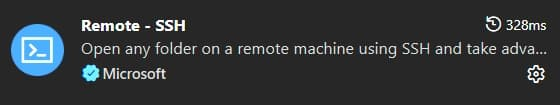
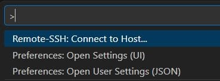
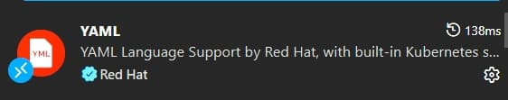
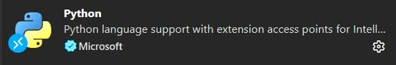
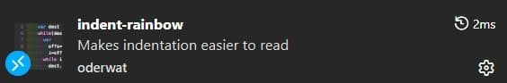
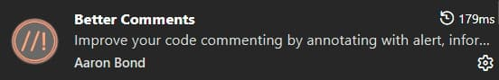





This is me documenting my journey of learning Ansible that is focused on network engineering. It's not a "how-to guide" per-say, more of a diary. Each part will build upon the last. A lot of information on here is so I can come back to and reference later. I also learn best when teaching someone, and this is kind of me teaching.

## VS Code with Remote-SSH

I used VS Code to SSH into my Ubuntu VM, since with VS Code I can easily create directories, files, and it makes it easier to write YAML code.

{}

### Installating the Remote-SSH Extension

I opened VX Code and went to the Extensions panel (`Ctrl+Shift+X`). I searched for 'Remote - SSH' by Microsoft and clicked 'Install'.



- **Remote - SSH** : connects to any SSH host
- **Remote - SSH: Editing Configuration Files** : gives me a UI to manage SSH config
- **Remote - Explorer** : sidebar panel to manage my remote connections


  The Remote-SSH extension does not just give me a terminal. It installs a small VS Code Server on the remote Ubuntu machine the first time I connect. After that, every extension I install (Python, Ansible, YAML, etc.) installs on the Ubuntu VM, not on Windows. This means my editor's IntelliSense, linting, and autocomplete all run against the actual Linux environment where Ansible lives.


### Connecting to Ubuntu VM

Right now I'm just setting everything up, so I will create an SSH-key with no passphrase.

---

#### SSH Keys {class="no-step-marker"}


  **How SSH Key Authentication Works**

  When I generate an SSH key pair, I get 2 files:
  - **Private key** - stays on my machine, never shared, treated like a password
  - **Public key** - placed on every server I want to connect to

  When I SSH in, the server uses the public key to issue a challenge that only the private key can solve. No password ever crosses the network.


On my Windows PC, I ran the following on PowerShell:

```
ssh-keygen -t ed25519 -C "ansible-key" -f "c\users\nesto\.ssh\ansible_key"
```



- `-t ed25519` - specifies the key type. Ed25519 is the modern standard (faster and more secure than the older RSA 2048 keys)
- `-C "ansible-key"` - a comment/label embedded in the public key to identify it later.
- `-f` - specifies the output filename.



When prompted for a passphrase, I pressed 'Enter' to skip it.

---

#### Copying the Public Key to Ubuntu {class="no-step-marker"}

Now I need to put the public key on my VM. One way is to issue this PowerShell command:

```
type c:\users\nesto\.ssh\ansible_key.pub | ssh ansible@192.168.1.50 "mkdir -p ~/.ssh && cat >> ~/.ssh/authorized_keys && chmod 600 ~/.ssh/authorized_keys && chmod 700 ~/.ssh"
```



- `type` - reads my public key file on Windows
- Pipes it over SSH into the Ubuntu VM
- Creates `~/.ssh/` if it doesn't exist
- Appends my public key to `~/.ssh/authorized_keys`
- Sets correct permissions on both the file and directory





`authorized_keys` is the file Ubuntu checks when I SSH in. It can hold multiple public keys (1 per line). This is how I'd add keys for multiple engineers or multiple machines to the same server.



Then to test if it worked, I issued the following command from VS Code:

```
ssh -i ~/.ssh/ansible_key ansible@10.33.99.50
```

---

#### Disabling Password Authentication {class="no-step-marker"}

Once key-based auth is confirmed working, I disable password SSH login on Ubuntu entirely.

```
sudo nano /etc/ssh/sshd_config
```

I find and change these lines:

```ini
PasswordAuthentication no
PubkeyAuthentication yes
PermitRootLogin no
```

Then I restart SSH:

```
sudo systemctl restart ssh
```


I never disable password authentication before confirming my key-based login works in a separate session. If I lock myself out of the VM, I'll have to use Proxmox's console to fit it.

The safe sequence:
1. Confirm key login works
2. Open a second terminal with the key
3. Disable password auth
4. Test a 3rd connection attempt to confirm it works before closing anything


---

#### Connecting via SSH-Remote {class="no-step-marker"}

Now, back in VS Code, I pressed `Ctrl+Shift+P` to open the Command Palette and typed:

```
Remote-SSH: Connect to Host
```



It then asked for a host:

```
ansible@10.33.99.95
```

VS Code opened a new window, downloaded the VS Code Server onto the Ubuntu VM and connected. I now have a fully functional VS Code environment running on Ubuntu. I can open a terminal in VS Code and it drops me directly into a bash shell on the VM.

---

### VS Code Extensions

Next, I installed some extensions on the remote host (VS Code will show a "Install on SSH: ansible-leb" button rather than a plain "Install" button).



1. **YAML (by Red Hat)** - Almost everything in Ansible is YAML. This extension gives me syntax highlighting, schema validation, and auto-formatting for `.yaml` files. After installing it automatically validates Ansible playbooks against the Ansible YAML schema.


2. **Ansible (by Red Hat)** - This is purpose-built for Ansible work. It provides auto-completion for Ansible module names and parameters, definition for roles and variables, integration with `ansible-lint`, and syntax highlighting for Jinja2 expressions inside YAML files.



3. **Python (by Microsoft)** - Since Ansible is Python-based and I'll be writing Python scripts alongside my playbooks, this is essential. It give sme IntelliSense, debugging, and virtual environment detection.


4. **GitLens (by GitKaraken)** - GitLens supercharges VS Code's built-in Git support. Inline blame annotations that show me who last changed a line and when, directly in the editor. For a team environment, this is invaluable when tracking down who made a change to a playbook.



5. **indent-rainbow** - Ansible YAML is white-space sensitive. A misplaced indent breaks everything. This extension color codes indentation levels, making it immediately obvious when something is off.



6. **Better Comments** - Lets me color code comments in my playbooks.



After installing extensions on the remote SSH host, I open VS Code’s settings (Ctrl+,) and search for yaml.schemas. I can point the YAML extension at the Ansible schema so it validates my playbooks automatically. The Red Hat Ansible extension handles most of this automatically, but it’s worth knowing the setting exists.


{}

---

### Linux Command Line Basics

This is just a quick reference to some Linux commands.

---

{}

#### Navigation

```bash {hl_lines=[2]}
pwd                        # Print working directory — "where am I?"
ls -la                     # List all files including hidden ones, with permissions
cd /etc/ansible            # Change into a directory
cd ~                       # Go back to my home directory
cd ..                      # Go up one directory level
```

`ls -la` **output explained:**

The first column shows permissions (e.g. `-rw-r--r--). The 3rd and 4th columns show the owner and group. The last column is the filename.

---

#### File Operations

```bash
cp playbook.yml playbook.yml.bak     # Copy a file (useful before editing)
mv old_name.yml new_name.yml         # Rename or move a file
rm file.yml                          # Delete a file (no trash, gone forever)
mkdir -p roles/cisco_ios/tasks       # Create directories, including parents (-p)
cat inventory/hosts.yml              # Print file contents to terminal
less playbook.yml                    # Scroll through a file (q to quit)
```

---

#### Searching

```bash {hl_lines=[1]}
grep -r "ios_config" ./playbooks/    # Search recursively for a string in files
grep -n "hostname" site.yml          # Show line numbers with matches
find . -name "*.yml"                 # Find all YAML files from current directory
```

`grep -r "ios_config" ./playbooks/` **command explained:**

- `r` - means recursive (search all subdirectories too)
- `"ios_config"` - is the search term
- `./playbooks/` - is where to search.

---

#### File Permissions

Permissions matter most for 2 things in Ansible: SSH keys and vault password files. Both need to be readable only by me.

```bash
chmod 600 ~/.ssh/ansible_lab_key     # Owner read/write only — required for SSH keys
chmod 700 ~/.ssh/                    # Owner read/write/execute only — required for .ssh dir
chmod 644 playbook.yml               # Owner read/write, others read-only — normal for files
ls -la ~/.ssh/                       # Verify permissions look correct
```

**Understanding `chmod 600`:**

The 3 digits represent Owner, Group, Others. Each digit is a sum of read (4), write (2), and execute (1).

---

#### Keeping The System Updated

I set up a habit of running this at the start of any lab session:

```
sudo apt update && sudo apt upgrade -y
```

Here are the packages I install on any fresh Ubuntu VM that I'll be using with Ansible:

```bash
sudo apt install -y \
    curl \
    wget \
    git \
    vim \
    nano \
    net-tools \
    openssh-server \
    python3 \
    python3-pip \
    python3-venv \
    tmux \
    tree \
    unzip
```



- `curl` / `wget` - downloading files from the internet
- `git` - version control
- `net-tools` - provides `ifconfig` and `netstat` for troubleshooting
- `openssh-server` - SSH server
- `python3-venv` - virtual environment support
- `tmux` - persistent terminal sessions
- `tree` - displays directory structures visually.



---

#### Home Directory Structure

When I log into my VM, I land in my home directory `/home/nesto`. This is my personal space on the system. Understanding how to organize it sets me up for clean Ansible project management.

**What Lives Where**

```
/home/ansible/               # My home directory (~)
├── .ssh/                    # SSH keys and known_hosts (always chmod 700)
│   ├── authorized_keys      # Public keys allowed to log in as me
│   └── known_hosts          # Fingerprints of hosts I've SSH'd to
├── .bashrc                  # Shell config, runs on every new terminal
├── .bash_profile            # Runs at login (not every terminal)
├── projects/                # Where I keep all my Ansible projects
│   └── ansible-network/     # My main project repo (covered in Part 4)
└── venvs/                   # Python virtual environments (covered in Part 3)
    └── ansible-env/
```

---

**Key Directories**

```bash
/etc/                        # System-wide configuration files
/etc/ansible/                # Default location for ansible.cfg (before project setup)
/usr/bin/                    # System executables (where 'ansible' binary lives after install)
/var/log/                    # System logs
/tmp/                        # Temporary files, cleared on reboot
```


I keep all my Ansible projects under `~/projects/`. That way, when I come back to a project after weeks or months, I know exactly where to find everything. This also makes Git management cleaner, each project is its own directory and its own repo.


{}

---

### Persistent Terminal Sessions

Here's a problem I ran into early. I'm running a long Ansible playbook against 200 devices. My laptop goes to sleep, VS Code disconnected, and the SSH sessions dies, taking the running playbook with it. `tmux` solves this completely.

`tmux` is a terminal multiplexer. It runs a terminal sessions on the Ubuntu VM that persists even when I disconnect. When I reconnect, I just re-attach to the session and everything is exactly as I left it.

{}

#### tmux Concepts

- **Session** - a peristent workspace. It survives disconnects
- **Window** - like a tab inside a session. I can have multiple windows.
- **Pane** - a split within a window. I can have a playbook running in 1 pane and watch logs in another.

---

#### tmux Commands

```bash
tmux new -s ansible-lab         # Create a new session named "ansible-lab"
tmux attach -t ansible-lab      # Re-attach to an existing session
tmux ls                         # List all active sessions
```

Inside tmux all commands start with the prefix `Ctrl+B`:

```
Ctrl+B, d               # Detach from session (session keeps running)
Ctrl+B, c               # Create a new window
Ctrl+B, n               # Next window
Ctrl+B, p               # Previous window
Ctrl+B, "               # Split pane horizontally
Ctrl+B, %               # Split pane vertically
Ctrl+B, arrow keys      # Move between panes
Ctrl+B, z               # Zoom a pane to full screen (zoom again to restore)
Ctrl+B, [               # Enter scroll mode (use arrow keys, q to exit)
```

> [!TIP]
> Sroll mode (`Ctrl+B, [`]) is 1 of the most useful tmux features for Ansible. When a playbook produces hundreds of lines of output, I can scroll back through all of it without losing my prompt.

---

#### tmux Workflow

Every time I start a lab sessions I do this:

```bash
# Check if my session already exists
tmux ls

# If it does, attach to it
tmux attach -t ansible-lab

# If it doesn't, create it
tmux new -s ansible-lab
```

Inside the session I create 2 windows:

- `Window 1` - Running playbooks
- `Window 2` - Editing files, checking logs

> [!CAUTION]
> tmux sessions persist until the Ubuntu VM reboots or I explicitly kill them (`tmux kill-session -t ansible-lab`). Over time, if I forget about old sessions, they pile up. I make a habit of checking `tmux ls` and cleaning up finished sessions.


{}

---

With Part 1 complete, my workspace is ready. I have a stable, secure SSH connection from VS Code into my Ubuntu VM, a clean directory structure, an updated system, and tmux keeping my sessions alive. Everything from here on is built on this foundation.